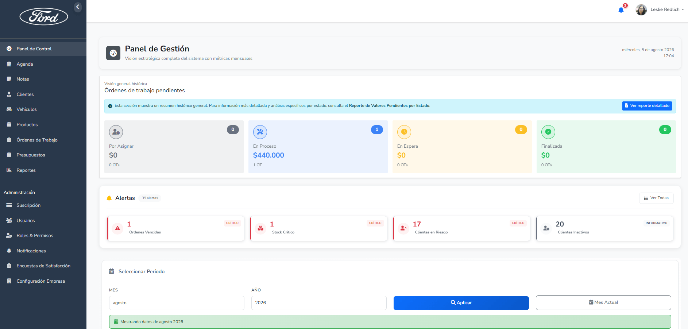
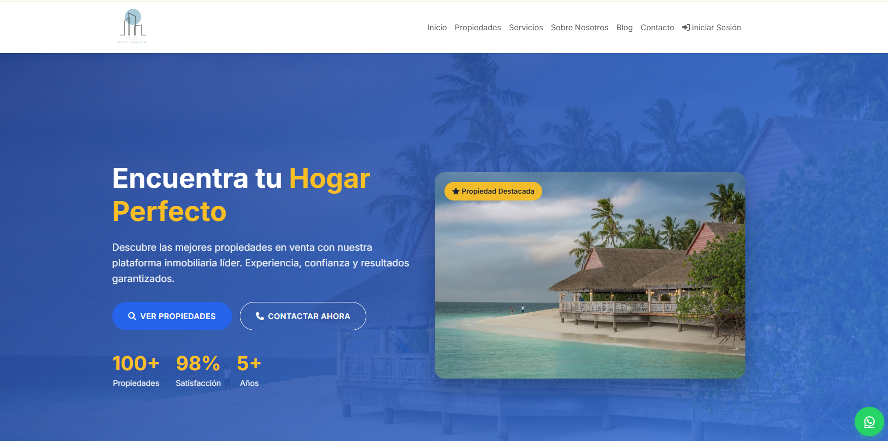
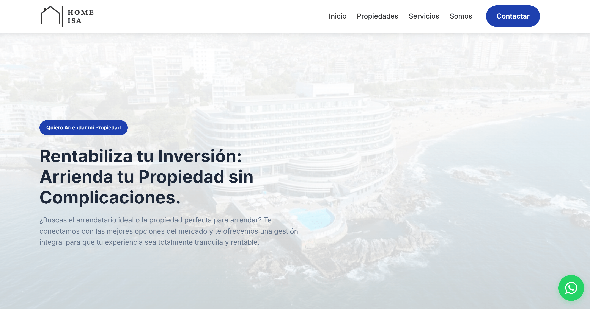
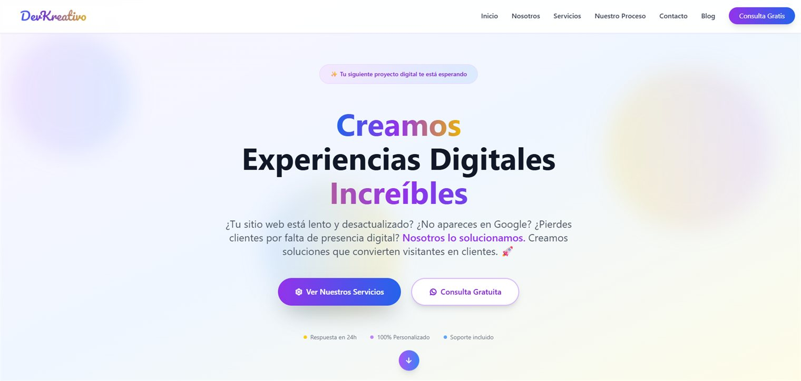

  
  
  

---

## Sobre mí

**Ingeniera de Ejecución en Informática** con una sólida trayectoria desarrollando software, principalmente en equipos remotos. He diseñado y desplegado sistemas internos, mesas de ayuda y plataformas de gestión a medida.

Aunque tengo experiencia en todo el ciclo de desarrollo, mi especialidad está en el **backend**: modelar datos, estructurar APIs sólidas y dejar toda la arquitectura bien conectada.

Mi base principal ha sido el **ecosistema PHP**, tecnología que sigo aplicando en proyectos complejos como plataformas multi-tenant. Además, sigo expandiendo mis habilidades hacia el entorno **JavaScript Full Stack**, con Node.js y PostgreSQL.

| | |
|---|---|
| **Título** | Ingeniera de Ejecución en Informática — AIEP, 2013, con distinción |
| **Experiencia** | Más de una década desarrollando software |
| **Especialidad** | Backend · arquitectura de datos · APIs |
| **Formación** | Bootcamp Full Stack JavaScript |
| **Ubicación** | Chile · remoto o híbrido |

---

## Stack Técnico

**Frontend**

**Backend**

**Bases de Datos**

**CMS & Herramientas**

---

## Proyectos Destacados

### Promecánica — SaaS de Gestión para Talleres Mecánicos

> Plataforma **multi-tenant** que administra la operación completa de un taller mecánico: órdenes de trabajo, inventario, cotizaciones, clientes y facturación. Cada taller opera sobre su propia base de datos aislada.

  
   
  <i>Panel de gestión: métricas mensuales, órdenes de trabajo por estado y alertas operativas</i>

**Lo que resuelve**

| Módulo | Detalle |
|---|---|
| Operación | Órdenes de trabajo con ítems, adjuntos, historial de estados y descuento automático de stock |
| Inventario | Productos, marcas, categorías, ubicaciones de bodega y devoluciones |
| Comercial | Clientes con etiquetas, leads, agenda de eventos y encuestas de satisfacción |
| SaaS | Tenants aislados, planes, suscripciones y módulos activables por cliente |
| Pagos | Integración con **Transbank** y **Mercado Pago** (pasarela de pagos de Chile) |

**Stack:** Laravel 11 · PHP 8.2 · Inertia.js · Sanctum · Spatie Permissions · Tailwind · Docker · MySQL

<!-- REEMPLAZAR: URL de la demo en vivo -->
<!-- [**Ver demo**](#)--> · Código privado — disponible bajo solicitud 

---

### Sistema de Gestión Inmobiliaria

> Sistema integral para automatizar los procesos de una corredora de propiedades: publicación, captación de leads y seguimiento comercial, con panel administrativo y roles diferenciados.

  

**Funcionalidades clave**
- CRUD completo de propiedades con carga de imágenes y estados (activa / vendida / inactiva)
- Captura automática de leads desde formularios públicos y asignación a agentes
- Módulo de tasaciones y sistema de usuarios con roles específicos
- Vista pública responsive + panel administrativo

**Stack:** Laravel 9 · PHP 8 · Blade · Bootstrap 5 · MySQL

<!-- REEMPLAZAR: URL de la demo en vivo -->
<!-- [**Ver demo**](#)--> 
[**Ver código**](https://github.com/leslieredlich/gestion_inmobiliaria) 

---

### Propiedades — Tema WordPress a Medida

> Tema WordPress desarrollado desde cero para corredoras de propiedades, optimizado para el mercado de la **Cuarta Región de Chile**. No es una plantilla adaptada: los Custom Post Types y el buscador están diseñados para el rubro.

  

**Funcionalidades clave**
- Custom Post Types para gestión de propiedades
- Búsqueda avanzada por comuna, tipo y rango de precio
- Sliders diferenciados de venta y arriendo con controles táctiles
- Estructura orientada a conversión con CTAs estratégicos
- Mobile-first con menú hamburguesa y formularios optimizados

**Stack:** WordPress · PHP · JavaScript · CSS3

<!-- REEMPLAZAR: URL de la demo en vivo -->
<!-- [**Ver demo**](#)-->
[**Ver código**](https://github.com/leslieredlich/propiedades)

---

### API de Países — Acceso a Datos con PostgreSQL

> Proyecto donde más se nota el trabajo de backend puro: paginación con **cursores de PostgreSQL** y escritura **transaccional** con COMMIT/ROLLBACK sobre tres tablas relacionadas.

<!-- PENDIENTE: guarda la captura en docs/api-paises.png y descomenta el bloque de abajo

  

-->

**Lo técnicamente interesante**
- Lectura por bloques usando `pg-cursor`, avanzando página a página desde el frontend en lugar de cargar todo en memoria
- Inserción transaccional en `paises` y `paises_pib`, con rollback ante fallo y registro posterior en la tabla de auditoría `paises_data_web`
- Manejo de errores del backend propagado y renderizado de forma legible en el cliente

**Stack:** Node.js · Express · PostgreSQL · pg / pg-cursor · JavaScript

<!-- REEMPLAZAR: URL de la demo en vivo -->
<!-- [**Ver demo**](#)-->
[**Ver código**](https://github.com/leslieredlich/evaluacion-final-modulo-7)

---

### DevKreativo — Agencia de Desarrollo Web

> Sitio corporativo de agencia de desarrollo web y marketing digital, construido con componentes modulares reutilizables e integración de Google Maps.

  

**Funcionalidades clave**
- Arquitectura de componentes reutilizables para escalar el sitio sin duplicar código
- Diseño responsive con secciones orientadas a conversión
- Integración de Google Maps y formulario de contacto

**Stack:** Next.js 15 · React 19 · TypeScript · Tailwind CSS

<!-- REEMPLAZAR: URL de la demo en vivo -->
<!-- [**Ver demo**](#)-->
[**Ver código**](https://github.com/leslieredlich/devstudio)

---

### A&R Plus — Taller Mecánico

> Sitio corporativo para un taller mecánico especialista en Mercedes Benz: presenta los servicios, muestra los trabajos realizados y convierte visitas en contactos directos por WhatsApp.

  

**Funcionalidades clave**
- Galería de trabajos realizados
- Formulario de presupuesto integrado con Formspree
- Contacto directo por WhatsApp y ubicación en Google Maps
- Diseño mobile-first optimizado para producción

**Stack:** Next.js 15 · TypeScript · Tailwind CSS · Formspree

---

### Otros Proyectos

| Proyecto | Descripción | Stack | Enlaces |
|---|---|---|---|
| **Intranet Promecánica** | Panel de administración central del SaaS Promecánica: alta y gestión de tenants con bases de datos independientes, usuarios con roles y permisos granulares, suscripciones, leads comerciales y reportes | Laravel · PHP · Blade · MySQL | Privado |
| **Registro de Mascotas** | API REST con arquitectura por capas para registrar, buscar y eliminar mascotas por nombre o RUT, con validación de datos y persistencia en JSON | Node.js · Express · JavaScript | [Código](https://github.com/leslieredlich/Registro-Mascotas) |
| **Belleza** | E-commerce para la venta de productos de belleza | TypeScript · React | [Código](https://github.com/leslieredlich/belleza) |
| **Blog ProMecánica** | Blog corporativo con tema propio, newsletter vía Mailchimp y SEO con schema.org | WordPress · PHP | Privado |

---

## Contáctame

&nbsp;

&nbsp;

&nbsp;

  

  

Gracias por pasar por aquí ✦

